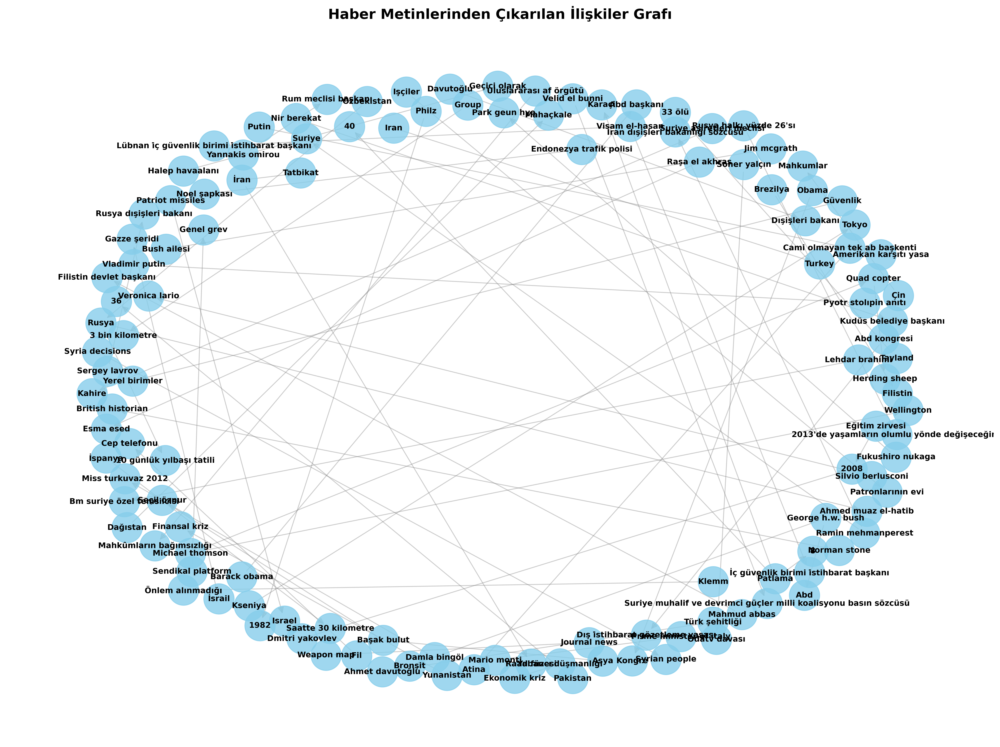

# Knowledge Graph (Graph RAG) from Turkish News with LlamaIndex

A project that processes ~42,000 Turkish news articles using [LlamaIndex](https://www.llamaindex.ai/) and Anthropic (Claude) to create a Knowledge Graph and query it with natural language (RAG - Retrieval-Augmented Generation).

The script extracts relationships (triplets) between entities, stores them in a graph database (SimpleGraphStore), and provides a query engine for natural language querying.

##  Key Features

- **Data Loading**: Reads ~42,000 news articles from `veri/42bin_haber/news` into a Pandas DataFrame
- **Graph RAG**: Automatically extracts knowledge triplets (subject, relation, object) using LlamaIndex's `KnowledgeGraphIndex`
- **LLM Integration**: Uses Anthropic `claude-sonnet-4-5-20250929` for relationship extraction
- **Embedding Integration**: Uses `BAAI/bge-small-en-v1.5` for semantic entity representation
- **Natural Language Querying**: Runs natural language queries on the constructed knowledge graph
- **Visualization**: Creates graph visualizations using `networkx` and `matplotlib`, saves as `.png` file

##  Technology Stack

- `llama-index` (Core, Anthropic LLM, SimpleGraphStore)
- `llama-index-embeddings-huggingface`
- `anthropic` (Claude API)
- `pandas` (Data loading)
- `networkx` (Graph analysis and visualization)
- `matplotlib` (Graph rendering)

##  Prerequisites

- Python 3.8+
- Anthropic API Key
- Dataset: 42K Turkish news articles in `.txt` format

##  Installation
```bash
pip install llama-index pandas networkx matplotlib llama-index-llms-anthropic llama-index-embeddings-huggingface torch
```

**Configure API Key:**

Set your Anthropic API key in the script:
```python
ANTHROPIC_API_KEY = "YOUR_API_KEY_HERE"
```

##  How It Works (Workflow)

1. **Data Loading**: Scans all `.txt` files in `veri/42bin_haber/news`, reads them, and converts to a Pandas DataFrame with `kategori` and `metin` columns

2. **Document Preparation**: Each DataFrame row is converted to a `llama_index.core.Document` object

3. **Model Initialization**: Loads Anthropic LLM (`claude-sonnet-4-5-20250929`) and HuggingFace embedding model (`BAAI/bge-small-en-v1.5`)

4. **Knowledge Graph Creation**: Calls `KnowledgeGraphIndex.from_documents`
   - **Note**: Uses first 50 documents (`documents[:50]`) as example instead of all 42,000
   - LLM analyzes these 50 documents and extracts relationships (triplets) with `max_triplets_per_chunk=1`
   - Triplets are stored in `SimpleGraphStore`

5. **Query Engine**: Creates a query engine (`as_query_engine`) from the constructed `kg_index`

6. **Querying**: Sends predefined queries (e.g., "What did Foreign Minister Davutoğlu say about...") to the engine and prints LLM-generated responses using graph knowledge

7. **Visualization**: Extracts all relationships (edges) from `graph_store`, converts to a directed graph using `networkx`, renders with `matplotlib`, and saves as `bilgi_grafi.png`

##  Sample Outputs

**Query 1:**
```text
Query: What did Foreign Minister Davutoğlu say about Greece and Turkey?
Response: Foreign Minister Davutoğlu stated that differences between Greece and Turkey can be resolved through a common vision. He noted that while there may be disagreements and different approaches between the two countries, problems can be more easily solved by sharing the same vision. He emphasized that his conclusion from meetings with his Greek counterpart supports this approach. Davutoğlu announced that the first seeds of common understandings in many areas have been planted and a meeting will take place in Turkey in January under the co-chairmanship of both prime ministers.
```

**Query 2:**
```text
Query: What was written about Borsa Istanbul?
Response: There is no information about Borsa Istanbul in the provided context. The given content does not contain any articles or information on this topic.
```

**Query 3:**
```text
Query: What are the effects of the interest rate decision?
Response: Unfortunately, there is no information about the effects of interest rate decisions in the provided context. To answer this question, I would need sources containing information about interest rate decisions and their economic, financial, or social impacts.
```

##  Project Structure
```
knowledge_graph_project/
├── veri/
│   └── 42bin_haber/
│       └── news/                # Turkish news articles (.txt files)
├── graph_rag.py                 # Main script
├── bilgi_grafi.png              # Generated graph visualization
└── requirements.txt             # Python dependencies
```

##  Graph Visualization

The extracted relationships are visualized and saved as `bilgi_grafi.png`:



##  Configuration

**Adjust processing scale:**
```python
# Process only first N documents (for testing)
kg_index = KnowledgeGraphIndex.from_documents(
    documents[:50],  # Change 50 to desired number
    ...
)
```

**Adjust triplet extraction:**
```python
max_triplets_per_chunk=1  # Increase for more relationships per document
```

##  Use Cases

- **Information Discovery**: Find hidden relationships in large news corpora
- **Entity Analysis**: Track how entities (people, organizations, places) relate
- **Question Answering**: Natural language queries on structured knowledge
- **Knowledge Exploration**: Visual navigation of news content relationships

##  Notes

- Processing all 42,000 documents requires significant computational resources and API credits
- Start with a smaller subset (50-100 documents) for testing
- Visualization may become cluttered with large graphs - consider filtering or sampling


